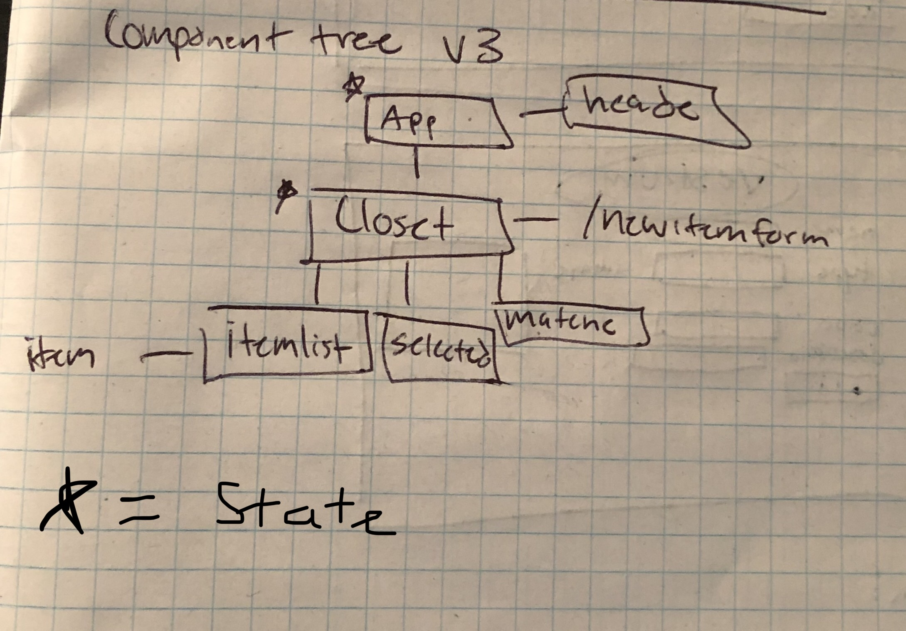
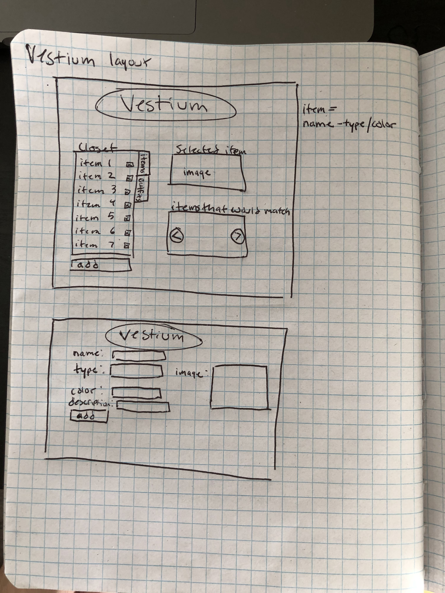
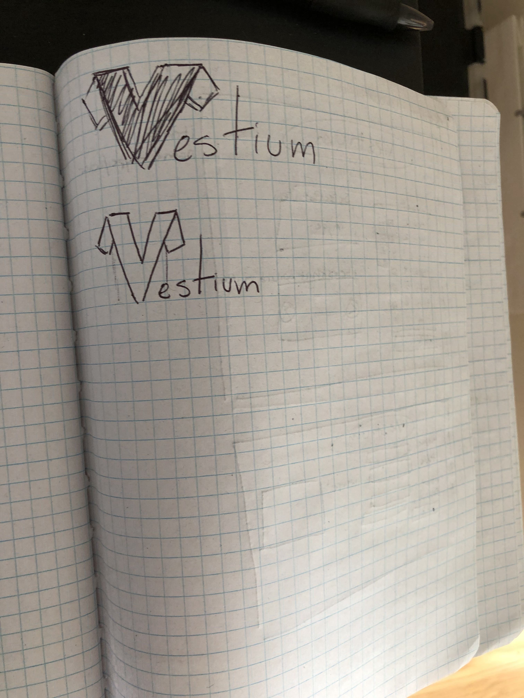

## VESTIUM
By Daniel Bennett
## Description
Ever find a shirt in your closet but never know what pants go well with it? By using Vestium the virtual closet you can easily see what's in your closet and what would go with what. By selecting a shirt from the closet of clothes VESTIUM will select what will look good with that selection.
 VESTIUM uses a self created logic based off personally conducted research and running the logic by other people to create an actual logic that isn't just based of color theory.

## Logic for app
Shirt // Pants

Red // Khaki, black, dark blue?, brown 
Yellow // black, dark jeans 
White // black, khaki, orange, green, jean, grey, red, brown 
Black // black, orange, jean, green, khaki, grey, maroon  
Pink // black, blue, Khaki, grey?? 
Blue // black, khaki, orange, brown 
Purple // Khaki, black, dark jeans 
Orange // Black, dark jean 
Green // khaki, Black, dark jean. light grey 
Grey // Pink?, Green, jean, black, red 
Brown // Khaki, black, dark jean, blue

Pants // Shirt

Red // white, black, grey 
Yellow // yellow, black 
White // black, yellow, orange, green, blue, grey, red, brown 
Black // black, orange, jean, green, grey, red, blue, yellow, white, brown 
Blue // pink, black, white 
Orange // blue, black, white 
Green // grey, white, black 
Grey //  green, black, white, pink, grey 
Brown // blue, white, black, red 
Khaki // red, white, black, pink, blue, purple, orange, green, grey, brown
Navy // red, white, black, pink, purple, orange, green, grey, brown

## Component Tree

State lives in App.jsx and Closer.jsx where it is then passed to itemlist/matched/selected. State is lifted from both selected and newItemForm.

## Layout/Logo Ideas

# Next Steps
* style page
* look at stretch goals

* image react bootstrap carousel
